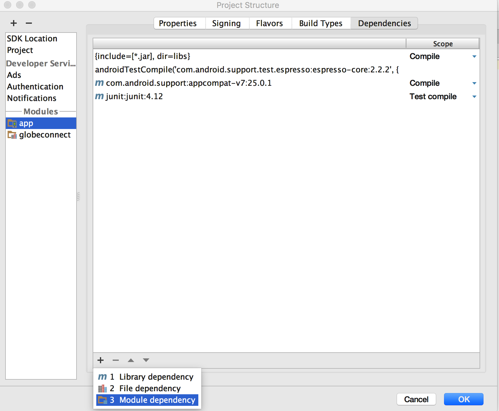

# Installing the SDK Manually via the SDK Builder.

Below are the step by step procedure on how to install the sdk on your new or existing project manually, below also shows the list of the requirements for the sdk to work properly.

## Requirements

- Java >= 7
- Android SDK (minimum version 14, target version 25)
- Android API 16 to 24 is the current support.
- Android Studio (or other IDE with the same functionality, we will use Android Studio for most of the examples).

#### Step 1. Go to the SDK Builder page.

For the first step, we need to download the sdk via the sdk builder site located at [globelabs.github.io](http://globelabs.github.io), select the platform and the api's that needs to be included in the sdk, in this case the platform that we need to use is android, after downloading the zip file that contains the sdk via the sdk builder site extract it then let's proceed to the next step where we are going to import the sdk to a new / existing android project.

### Step 2. Including the SDK to the project.

The contents of the extracted sdk zip file should look like this:


After extracting the sdk zip file, let's include the sdk on our project, on the left side of your Android Studio IDE select Project > Android, it will show the minified structure of your project, Right Click on your App folder > Open Module Settings, it should look like this:


after clicking the Open Module Settings a new pop-up window should show that looks like this:


now let's add a module by clicking on the plus sign located at the top left most of the module settings window, after clicking the plus sign, a new pop-up window should show up and it should look something like this:


select Import Gradle Project, we are going to import the sdk as a Gradle Project, then hit Next, it should show a new window that ask for the module's source directory, locate the sdk's "api" folder and hit "OK".


set the module name, this should be unique and is related to the module that we are going to import, we're going to use :globeconnect as the module name, the ":" prefix is required because of gradle so you should always prefix the module name with ":", after putting the module name, hit "Finish" then let's proceed to the next step.


>***NOTE*** After hitting "Finish", hit the "OK" button of the module settings window and wait for the Gradle Sync process to finish.

### Step 3. Setting the SDK as Project Dependency.

So the SDK is already included in the project but we need to add it as a dependency of our project, re-open Module Settings on the left side there is a Modules section, click on the "app" section, on the top most section click "Dependencies" tab and it should look like this:


Hit the plus sign at the bottom and hit "Module Dependency"


... and select the ":globeconnect" module or whatever name that you have set earlier for the module, now your dependency list should look like this:


hit "OK" and just wait for the Gradle Sync process to finish.

Now you should be able to see the autocompletion for the globe connect module, you can test it out by trying to import the module using the namespace ph.com.globe.connect, the autocomplete result should look like this:


When you start working with the sdk a few import directive is required for you to be able to work with the sdk, you are required to import:
- ```org.json.JSONObject``` (for handling the response results)
- ```org.json.JSONException``` (for handling json parsing errors)

Please also take into consideration that most of the SDK's API calls (HTTP Requests) are done asynchronously and is running on a separate thread so that the API calls are not interrupting the main UI Thread, this keeps the UI from lagging every time the app is executing an HTTP request.

### Extras

Here are some additional things to consider before building the app that includes the sdk.

### Android Permission

The sdk requires the INTERNET permission, to allow the sdk to use the INTERNET please put this xml snippet into your app's AndroidManifest.xml file.

```xml
<uses-permission android:name="android.permission.INTERNET" />
```
